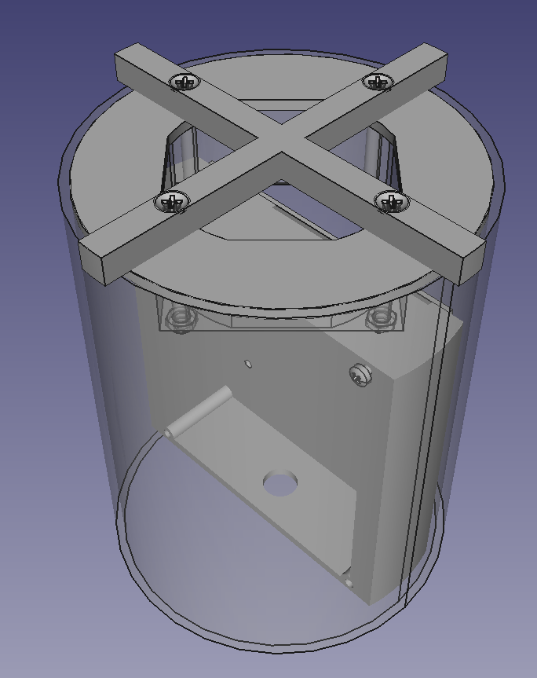

# OpenAir Quadsense Case

OpenAir enclosure, FreeCAD and stl files. The case was designed to be:

- Easy to make. Four custom parts are needed. All can be 3D printed or easily made by hand. Three of them can be cut (e.g. laser, plasma, waterjet). Tolerances should not be critical and resolvable with a file.
- Robust: All outside facing parts can use standard "HT" or "KG" installation material (DN110 tube, DN125 end cap)
- Cheap and available: Most parts are standard installation material, available in DIY hardware stores
- Flexible: Construction is (mostly) parametric, modules can be changed etc.

The openair full enclosure assembly can be seen in the FCStd file. It contains every part, including mock-ups of some boards. 

The stl files can be sent directly to a 3D printer.

